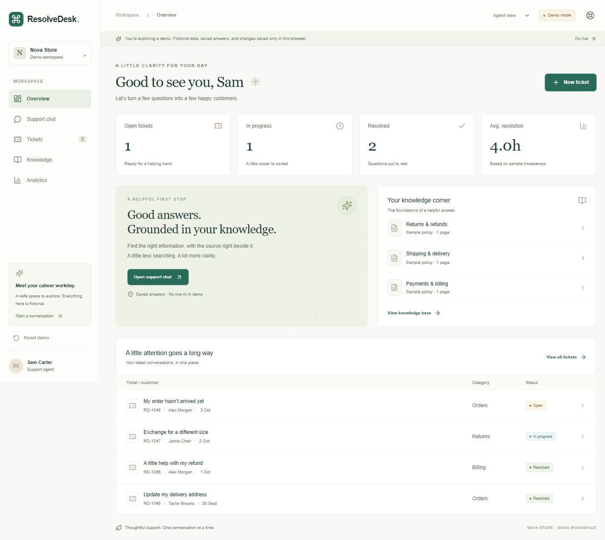

# ResolveDesk

[Live app](https://resolvedesk-mocha.vercel.app) · [Credential-free fictional demo](https://resolvedesk-mocha.vercel.app/?demo=1) · [Source](https://github.com/Singhroshni-2001/ResolveDesk)

Deployed on verified Vercel Hobby. Production customer/agent workflows and three-policy ingestion pass. The nine-case RAG main run had eight successes and one provider 503; the remaining case passed separately. See [measured results](docs/METRICS_REPORT.md) and [resume material](docs/RESUME.md). No billing, paid integrations or AI Gateway.

A portfolio support workspace: Next.js App Router + TypeScript + Tailwind CSS, Supabase PostgreSQL/Auth/Storage, pgvector and Gemini. The demo works entirely without accounts. Live mode uses your own free accounts.



Desktop (1440 × 900) and mobile (390 × 844) checks are recorded in [browser evidence](metrics/production-browser-checks.json): 25 passed checks, including six follow-ups on the updated deployment. [Live mobile citation preview](docs/evidence/production-rag-mobile-final.jpg) uses only fictional policy content. New production signup/email return was verified by the owner in Chrome; existing customer/agent login, logout and ticket reload were checked in the built-in browser. Supabase production Site URL and both production/local redirects are owner-verified. The latest deployment, public HTTP checks and CI run are recorded in [deployment evidence](metrics/production-deployment.json).

## Run locally

Requires Node 22.12+ and npm. In this folder:

```sh
npm ci
npm run dev
```

Open http://localhost:3000 and choose **Try the interactive demo**. Direct demo link: http://localhost:3000/?demo=1.

```sh
npm run test
npm run typecheck
npm run build
npm start
```

Do not run development and production servers on the same port. The lockfile pins the tested dependency tree. No fonts, images or paid UI services need to be downloaded at runtime.

## Demo vs live

Demo uses fictional Nova Store policies, customers and order references. Three exact example questions have saved answers and expandable source excerpts. Any other question gets an honest fallback; there is no pretend live AI. Tickets, replies and status changes persist only in the browser's `resolvedesk-demo-v1` local storage. **Reset demo** restores the sample. The perspective switch is only a demo feature. Customer Alex Morgan sees only Alex's sample tickets. Sample resolution metrics are computed from sample timestamps, never presented as production claims.

Live mode starts with empty state and never imports demo data. Email/password authentication is provided by Supabase. Server routes validate bearer tokens through `auth.getUser()`. All database access uses the signed-in user's JWT and the public anon key, with row-level security as a second boundary. No service-role key is used. Customers own tickets and private conversations. Agents see all tickets and manage the shared policy library, but do not see customers' private chats. Roles are provisioned only by the project owner through SQL; sign-up metadata cannot grant privileges.

An unconfigured live workspace shows a clear setup state. Missing AI settings, upstream failures and quota errors do not disable tickets or the demo. The live workspace currently loads the newest 500 tickets and 100 documents; analytics explicitly use that loaded set. This is a deliberately small single-store portfolio application, not a multi-tenant SaaS.

## Configure your Supabase Free project

1. Create a **new** project under your own Supabase account on the Free plan. Do not activate billing or upgrade. Keep existing projects untouched.
2. In its SQL editor, first inspect `supabase/verify-settings.sql`. If the schema is absent, run `supabase/migrations/001_resolvedesk.sql` once, then `supabase/migrations/002_explicit_access.sql`. If 001 was already applied, apply only the pending 002 after inspecting current grants. Migration 001 creates schema, RLS, the private `knowledge` storage bucket, pgvector, request limits and the profile trigger; 002 restricts permissions and hardens policies. Both are already applied to this project's live database. Do not rerun 001 over an existing schema; use a new migration for changes.
3. In Authentication → URL Configuration, use your production origin as Site URL when deployed (this project's origin is `https://resolvedesk-mocha.vercel.app`). Preserve existing redirects and allow `https://resolvedesk-mocha.vercel.app/**` and `http://localhost:3000/**` for this deployment. For a separate local-only project use `http://localhost:3000` as Site URL. Keep email confirmation enabled. Sign up, confirm email, then sign in. The default Supabase mail service has strict limits; use a few test accounts only.
4. Copy `.env.example` to **`.env.local`**. It is ignored. Enter the project URL and **public anon/publishable key** in the two `NEXT_PUBLIC_SUPABASE_*` variables. These are intentionally public; RLS secures access. Never put a service-role key into any public variable.
5. Create your own account through the app, then promote only the intended support account in the SQL editor:

```sql
update public.profiles set role = 'agent'
where id = (select id from auth.users where email = 'YOUR_AGENT_EMAIL');
```

Only a project owner should run that statement. Users have SELECT-only access to profiles. An `admin` role currently has the same workspace permissions as `agent`; no browser role editor exists.

6. Restart the local server after changing environment values. Create a second customer account to verify isolation. Use `tests/permissions.sql` in the SQL editor for transactional permission checks; it rolls back its test fixtures. Run it on a fresh test project before adding real data, since it checks exact fixture counts.

### File access policy

Only agents can upload, read originals, edit or delete documents/chunks. The `knowledge` bucket is private, with a 1 MB object limit and an explicit MIME allowlist. Authenticated customers can retrieve excerpts from **ready** documents through a limited search RPC. Upload only general customer-facing policies; publication makes excerpts visible to all signed-in customers. Do not upload internal notes or sensitive customer records.

## Gemini on the free tier

Current account test (2026-10-05): real 768-dimensional embedding and a schema-constrained synthetic cited answer PASS with the new Free-tier key using gemini-3.1-flash-lite. Earlier 2.5 Flash-Lite generation returned 404. End-to-end RAG is separately measured; see docs/METRICS_REPORT.md. Billing remains disabled.

Create an API key in your own Google AI Studio project with **Free tier and billing disabled**. Put it only in `GEMINI_API_KEY` in `.env.local` or Vercel server environment settings. Never paste it in chat or commit it.

Defaults checked against Google's official documentation on 2026-10-04:

- Answer: `gemini-3.1-flash-lite`, standard synchronous API.
- Embeddings: `gemini-embedding-2`, text input, 768 dimensions, standard synchronous API.

[Google's pricing table](https://ai.google.dev/gemini-api/docs/pricing) lists free-tier standard input/output for the answer model and free text embedding input. [Embedding documentation](https://ai.google.dev/gemini-api/docs/embeddings) documents model availability, dimensionality and task prefixes. There is no Batch API, Google Search grounding, paid fallback or managed File Search dependency.

Run `npm run verify:models` after adding your key. This checks whether your account can access the configured model identifiers, without printing the key. It cannot prove available quota or billing status; confirm those in AI Studio and test an actual upload and answer. If Google changes availability, deliberately update the configuration only after checking free-tier pricing. Changing embedding models requires removing and re-uploading documents; embedding spaces cannot be mixed. Query retrieval filters by the current model.

Free Gemini requests may be used by Google to improve products, per its pricing/terms. Use only fictional or non-sensitive policy content for this portfolio.

## RAG architecture

Browser → authenticated Next route → Supabase with user JWT → Gemini (server only).

Upload validates extension, MIME, signature, size and text content. Limits: 1 MB, 20 PDF pages, 24,000 extracted characters, 40 chunks. TXT/MD must be UTF-8. Encrypted, scanned, binary, empty and near-empty PDF pages are rejected. PDF extraction preserves page numbers; complex layouts can extract imperfectly. No OCR is performed.

An upload saves the original in private storage and atomically registers document metadata plus pending chunks. A SHA-256 content hash prevents duplicate documents. Chunks are 1,000 characters with 150-character overlap. A processing request embeds at most two chunks, each with an 18-second upstream timeout, under a 60-second route limit. The browser runs the next bounded request while open. Closing the tab pauses ingestion; **Resume / retry** processes only missing vectors. Chunk identity is unique, and conditional updates prevent duplicate chunk rows even across overlapping retries. Concurrent retries can still consume duplicate upstream requests, so use one processing tab. A failed registration attempts to remove the uploaded object; after an interrupted upload, an owner may need to remove an orphaned original from Storage.

Cosine retrieval selects up to five ready passages above a 0.35 threshold. This starting threshold is not a validated accuracy claim; tune it using the evaluation set after account setup. At most three previous turns (answers truncated to 1,000 characters) enter the prompt. History is scoped by conversation owner. Model output is schema-checked; invalid/absent citations and insufficient evidence produce an abstention. Citation labels map only to actual retrieved sources. Retrieved text and history are labelled as untrusted data, and no model tools can mutate tickets. Prompt injection defenses reduce risk; they are not a proof of semantic grounding.

Turns are persisted with request IDs. Current session chat is shown in the UI; reopening older conversations is supported through the history picker. Ticket creation always uses the explicit confirmation form. Ticket/reply UUIDs make retries idempotent. DB triggers stamp actual resolution times and clear them on reopening.

Per-user and shared hourly request counters are stored in PostgreSQL, so they work across serverless instances. Limits: chat 20/user + 100/workspace; uploads 10 + 40; processing batches 100 + 200; ticket creation 30 + 300; replies 60 + 600. They are deliberately conservative, not a guarantee against exhausting provider quotas. AI limits fail closed if the counter RPC is unavailable. Direct authenticated Supabase writes are still restricted by grants, constraints and RLS; API rate limits are not intended as comprehensive anti-abuse protection against deliberate direct-database traffic.

## Checks and walkthrough

For direct customer isolation, copy `.env.metrics.example` to ignored `.env.metrics.local` only if that file does not already exist. Enter the two confirmed customer emails/passwords privately, then run `npm run test:customers`. It preserves existing tickets, tests fresh API/RLS reads and denied cross-customer replies/status changes, and signs out only its own test sessions. Browser reload persistence is separately recorded. Add the dedicated agent credentials after owner provisioning to run `npm run test:live`, ingestion and `npm run metrics:live`. Never paste credentials in chat. See `docs/DEPLOYMENT_REVIEW.md` for the reviewable GitHub/Vercel plan.

See `docs/DEMO_WALKTHROUGH.md`, `tests/rag-evaluation.json`, `tests/permissions.sql` and `PROJECT_STATUS.md` for exact verification status. Automated unit tests cover input validation, fallback/citation behavior, document validation, chunking and resolution metrics. SQL checks exercise ownership and privilege boundaries. Those SQL checks require a configured Supabase test project unless the local database harness is available.

For RAG evaluation, use the three `samples/` policies. Run each question in the JSON file as a new live conversation; record answer, citations, expected behavior and pass/fail. The measured nine-case set includes answerable, unanswerable, misleading and action-boundary questions. Answers were compared with sources by the assistant; no general accuracy percentage or independent human evaluation is claimed. Adversarial instructions embedded in uploaded documents require an additional evaluation and are not covered by the current result.

## Existing deployment and updates

The owner authorized publication and this project is live at [resolvedesk-mocha.vercel.app](https://resolvedesk-mocha.vercel.app), with [source on GitHub](https://github.com/Singhroshni-2001/ResolveDesk). Updates preserve this deployment and the existing Supabase data. The Vercel account/team was verified as Hobby through its read-only billing.plan response; no paid services or AI Gateway are configured.

The existing project uses the Next.js preset, Node 22.x, `npm run build`, the default output directory and included vercel.app domain. Five application variables are configured privately in Vercel production settings. Only the two public Supabase variables are browser-exposed. Redeploy when public values change because Next embeds them at build time. The GitHub Actions workflow runs credential-free verification sequentially; CLI deployment is a separate action.

Before any update run `npm run verify` and `npm run verify:release`. The release check screens candidate source and reachable Git patches for token patterns and privately configured credential values, and checks public source for private hosted fixture IDs. It prints paths/booleans only. Environment files, `.vercel` state, raw hosted fixtures, customer screenshots and logs are ignored. Screening cannot prove the absence of unknown or encoded secrets. Vercel builds dependencies from `package-lock.json`; it does not apply SQL migrations.

Set `$env:EVAL_APP_URL='https://resolvedesk-mocha.vercel.app'` in PowerShell to target production for existing-account API checks. Run `npm run test:customers`, `npm run test:live` and `npm run test:ingestion` separately. Preserve dated failed attempts before rerunning metrics. See [deployment record](docs/DEPLOYMENT_REVIEW.md), [status](PROJECT_STATUS.md) and [handoff](HANDOFF.md) for the exact current verification state. Do not rerun the base migration or create replacement cloud projects to update this app.

## Free-plan limitations

Vercel Hobby is for personal/non-commercial use and has bounded compute/bandwidth. Supabase Free projects may pause when inactive and have bounded database/storage/auth/email quotas. Gemini quotas vary by project, model and region and can be zero even when a free tier is documented. There is no uptime promise, paid failover or background worker. The demo keeps working when live dependencies are missing or unavailable. See current [Vercel Hobby docs](https://vercel.com/docs/plans/hobby), [Supabase pricing](https://supabase.com/pricing) and [Gemini limits](https://ai.google.dev/gemini-api/docs/rate-limits) before deployment.

Recorded production evidence: 14 customer API/RLS checks, six customer/agent workflow groups and ten ingestion checks passed. The ready corpus contains three documents, three logical text pages and three chunks. The nine-case RAG run returned eight HTTP 200 responses and one upstream 503; case 9 passed separately. Successful-response median was 9.82 s and nearest-rank p95 13.46 s (n=8, serial, 15-second spacing, no warmup). These small-sample results establish neither general accuracy nor a production SLA. [Metrics report](docs/METRICS_REPORT.md) preserves methodology, failures and sample sizes; [resume material](docs/RESUME.md) uses measured claims only.
